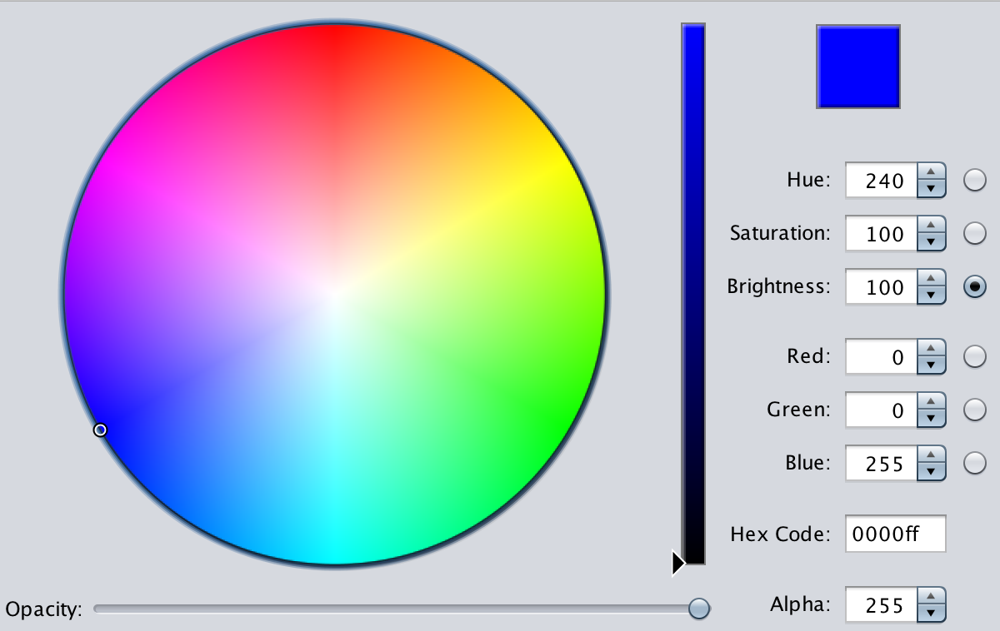

# :art: Java Swing Color Picker Dialog

[](http://search.maven.org/#search%7Cgav%7C1%7Cg%3A%22org.drjekyll%22%20AND%20a%3A%22colorpicker%22)
[](https://github.com/dheid/fontchooser/actions/workflows/build.yml)
[](https://ko-fi.com/W7W3EER56)

A nice color picker using Java Swing that contains a visual color selection and input boxes to enter RGB and HSB values manually:

* Two color modes HSV and RGB
* Includes an alpha selection
* Determine color by hex code
* Allows to select color by clicking on color wheel
* Minimal dependencies (only SLF4J)
* Compatible with Java versions since version 8
* Well documented
* Easy to use
* Completely free and open source



## :wrench: Usage

Include the following dependency to your project:

```xml 
<dependency>
  <groupId>org.drjekyll</groupId>
  <artifactId>colorpicker</artifactId>
  <version>2.0.1</version>
</dependency>
```

Use the class `com.bric.colorpicker.ColorPicker` as an entry point. You can easily initialize the panel using

```java
ColorPicker colorPicker = new ColorPicker(true, true);
colorPicker.addColorListener(colorModel -> System.out.println(colorModel.getColor()));
```

This creates a color picker component with expert controls and opacity settings. If the user selects a color, the color listener will be notified.

### :globe_with_meridians: Localization

The color picker supports localization. You can set the locale by passing it to the constructor:

```java
ColorPicker colorPicker = new ColorPicker(true, true, Locale.FRENCH);
// or
ColorPickerDialog.showDialog(null, Color.GREEN, Locale.FRENCH);
```

Currently, the following languages are supported:
- English
- Español
- Français
- Deutsch
- Português
- Русский

## :hammer: Building

Please use Maven to build and test the project.

    mvn install

This will install the version to your local repository. You can now include it:

```xml 
<dependency>
    <groupId>org.drjekyll</groupId>
    <artifactId>colorpicker</artifactId>
    <version>2.0.2-SNAPSHOT</version>
 </dependency>
```

or Gradle with Groovy DSL:

```groovy
implementation 'org.drjekyll:fontchooser:2.0.2-SNAPSHOT'
```

or Gradle with Kotlin DSL:

```kotlin
implementation("org.drjekyll:fontchooser:2.0.2-SNAPSHOT")
```


## :handshake: Contributing, Credits and History

Please see here: [Contributing](CONTRIBUTING.md)

This color picker was a part of the javagraphics project (http://javagraphics.blogspot.com), initiated by Jeremy Wood. The javagraphics project is a collection of small stand-alone projects.

The original color picker component is copyright 2011 by Jeremy Wood.

## :scroll: License

This modification of the color picker is released under a BSD 3-Clause
license. More details can be found here:
 
https://opensource.org/licenses/BSD-3-Clause

## :loudspeaker: Release Notes

### 2.0.1

* [Localization support](https://github.com/dheid/colorpicker/pull/55)

### 1.4.8

* [Illegal argument exception when color wheel is tiny](https://github.com/dheid/colorpicker/issues/51)

### 1.4.5

Prevent NPE on resize (https://github.com/dheid/colorpicker/issues/26)

### 1.4.3 and 1.4.4

Fixed null-pointer exception on changing slider

### 1.4.2

* Introduced Lombok
* Migrated to JUnit 5
* Updated dependencies and plugins
* Migrated to GitHub
